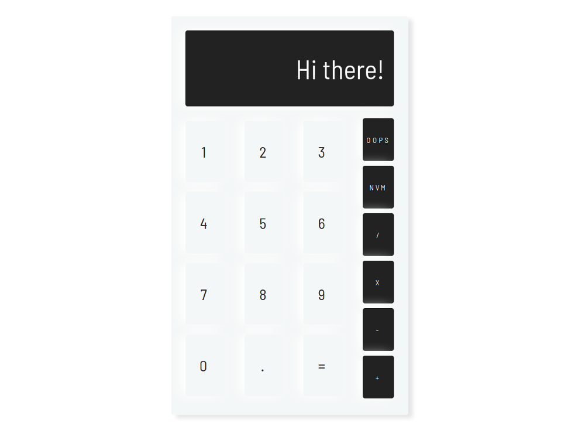

# minimalist-calc: A simple responsive JavaScript calculator

**See the whole thing working here: [vickylai.io/minimalist-calc](https://vickylai.io/minimalist-calc/)**

Equivalent capabilities to a very smart monkey doing Grade 6 homework.

Created initially for [FreeCodeCamp](https://www.freecodecamp.com/hivickylai)'s Front-End Developer Certification Course. The first (not actively maintained) version is on [CodePen](https://codepen.io/hivickylai/full/VWPqjq/).

## Screenshot

